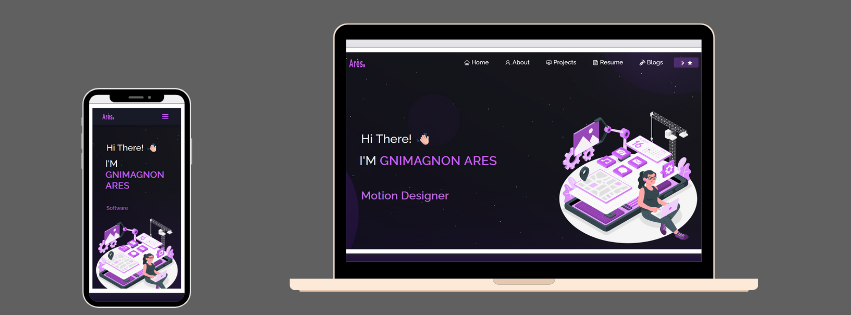

<h2 align="center">
  Portfolio Website - v1.0<br/>
  <a href="https://kloo.me/Ares-GNIMAGNON" target="_blank">aresgn.tech</a>
</h2>
<div align="center">
  
</div>

<br/>


## Built With

My personal portfolio <a href="https://kloo.me/Ares-GNIMAGNON" target="_blank">aresgn.tech</a> which features some of my github projects as well as my resume and technical skills.<br/>

This project was built using these technologies.

- React.js
- Node.js
- Express.js
- CSS3
- VsCode
- Vercel

## Features

**📖 Multi-Page Layout**

**🎨 Styled with React-Bootstrap and Css with easy to customize colors**

**📱 Fully Responsive**

# Portfolio Project

This is the source code for my personal portfolio website.

## Form Submission Setup with Formspree

The contact form uses Formspree to handle form submissions without requiring a backend server. This is an ideal solution when hosting on platforms like Vercel with a free plan.

### Steps to set up Formspree:

1. Go to [Formspree](https://formspree.io/) and create a free account
2. Create a new form and get your form ID (looks like `xzblvmkj`)
3. Update the `.env` file with your form ID:
   ```
   REACT_APP_FORMSPREE_FORM_ID=your-form-id
   ```
4. For production deployment on Vercel, add the environment variable in the Vercel project settings under "Environment Variables"

Formspree's free plan allows:
- 50 submissions per month
- Unlimited forms
- Email notifications
- Basic spam protection

## Troubleshooting "Parlons de votre projet" Button

If the "Let's talk about your project" button isn't clickable:

1. Make sure you have the latest code from this repository
2. The button has been updated with a higher z-index to ensure it's clickable
3. CSS has been added to enforce proper styling and interactivity
4. The navigation timing has been improved to ensure the form loads properly before scrolling

## Development

1. Clone the repository
2. Install dependencies with `npm install`
3. Create a `.env` file with necessary environment variables
4. Run the development server with `npm start`

## Deployment

This project is set up for deployment on Vercel:

1. Push your code to GitHub
2. Connect your GitHub repository to Vercel
3. Set up environment variables in the Vercel project settings
4. Deploy

